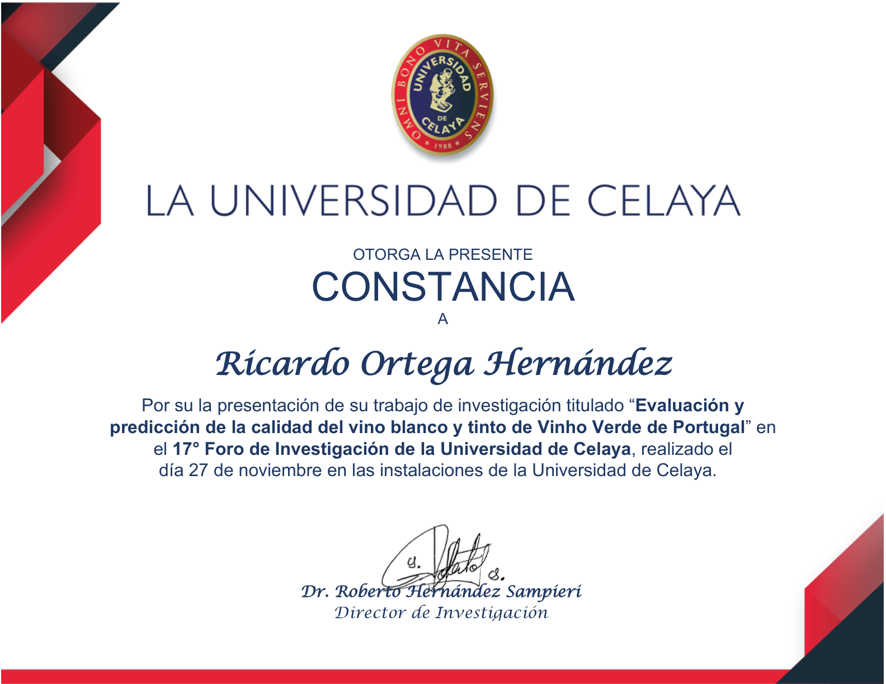

# 🍷 Evaluación y Predicción de Calidad de Vino

<div align="center">


**Pipeline completo de Machine Learning para predecir si un vino es de buena calidad a partir de sus propiedades fisicoquímicas.**

*Dataset: UCI Wine Quality — 6,497 muestras · 9 modelos comparados · SHAP · Optuna · SMOTE*

</div>

---

## 📖 La historia detrás del proyecto

> *Antes de revisar la documentación técnica, me encantaría que me regalaras dos minutos para contarte la historia detrás de este proyecto. Porque más allá de los modelos, las métricas y el código, representa el inicio de mi camino en el mundo de la Ciencia de Datos.*

Este proyecto es muy especial para mí porque fue mi **primer proyecto de Machine Learning**. Y la verdad, si hoy me preguntas cuál proyecto recuerdo con más cariño, probablemente sea este.

Todo comenzó en **tercer semestre**, en la materia de Investigación Aplicada. Mis compañeros de Ingeniería en Ciencia de Datos y yo teníamos que elegir un proyecto para desarrollar durante el semestre. Después de buscar varias opciones, encontramos un dataset sobre la calidad de los vinos y nos pareció interesante.

La idea original era relativamente simple: analizar si existía una correlación lineal entre las variables fisicoquímicas y la calidad del vino. Sin embargo, mientras llevaba materias como Estadística y Cálculo, ya empezaba a darme cuenta de que el mundo real rara vez es tan sencillo. No todas las relaciones son lineales y, además, existía la posibilidad de construir modelos capaces de hacer predicciones.

Entonces empecé a pensar: **¿y si llevamos esto un poco más lejos?**

El detalle era que Machine Learning aparecía en mi plan de estudios hasta sexto semestre y yo apenas iba en tercero. En teoría todavía no me tocaba aprenderlo. Pero algo que me encanta de la época en la que vivimos es que ya no tienes que esperar a que una materia llegue para aprender algo. Si tienes curiosidad, internet, documentación y ganas de intentarlo, puedes aventarte al reto e ir aprendiendo sobre la marcha.

Y eso fue exactamente lo que hice.

Pasé muchas horas investigando conceptos que no conocía, viendo videos, leyendo documentación, equivocándome y corrigiendo errores. Hubo momentos donde ni siquiera entendía completamente qué estaba haciendo, pero poco a poco todo empezó a tener sentido.

---

### 🏆 Reconocimiento en el 17° Foro de Investigación — Universidad de Celaya

Al final logramos sacar adelante el proyecto. Fue reconocido dentro de la clase y posteriormente se presentó en el **17° Foro de Investigación de la Universidad de Celaya**.

Algo que recuerdo con mucho orgullo es que el proyecto recibió reconocimiento por parte del **Dr. Roberto Hernández Sampieri** — uno de los investigadores más importantes de Latinoamérica en metodología de la investigación y autor de libros que miles de estudiantes han utilizado. El Dr. tomó el micrófono y reconoció el proyecto frente a todo el público del Teatro Nieto Piña, mencionando que era *"el proyecto más cercano a la Ciencia de Datos y al análisis predictivo"* que recordaba haber visto presentado en los foros de investigación.

Escuchar eso fue algo que me llenó de orgullo — no solo por el reconocimiento, sino porque confirmó que habíamos logrado llevar una idea mucho más allá de lo que originalmente se esperaba para la materia.

<div align="center">
  
  <br/>
  <em>Constancia del 17° Foro de Investigación — Universidad de Celaya</em>
</div>

---

### 🔄 La refactorización: siete meses después

¿Era un proyecto perfecto? **Para nada.**

Era un modelo algo flojo, sin demasiada profundidad y muy lejos de una estructura profesional. Pero justamente por eso decidí volver a él siete meses después, ya con más conocimiento.

Aprovechando el surgimiento de agentes de programación como **Claude Code**, me propuse refactorizar por completo el proyecto. Al principio pensé que simplemente iba a tomar mi código y organizarlo mejor en carpetas, pero terminé descubriendo algo mucho más interesante: **cuando la IA se combina con conocimiento del dominio, puede convertirse en una herramienta increíblemente poderosa.**

Como ya conocía bastante bien el problema de los vinos gracias a toda la investigación previa, fui guiando a la IA durante el proceso. Y eso marcó una gran diferencia.

Pasamos de probar un par de modelos a **evaluar más de nueve algoritmos distintos**. También incorporamos una etapa mucho más sólida de ingeniería de características. De hecho, una de las variables derivadas que terminamos creando — `density_alcohol_interaction` — resultó ser la **característica con mayor importancia** dentro del modelo final con un 16.77%.

> *Algo que aprendí durante este proceso es que la IA puede ayudarte muchísimo, pero no puedes simplemente dejarla trabajar sola. Hay que darle contexto, cuestionar sus propuestas y entender si realmente tienen sentido para el problema que estás resolviendo.*
>
> *Por ejemplo, imagina un dataset de fútbol: crear una variable como "diferencia de goles" tiene todo el sentido del mundo. Pero si alguien propone "goles a favor multiplicados por el número del capitán", técnicamente se puede crear — pero eso no significa que aporte valor. Esa experiencia me ayudó a entender que la ingeniería de características sigue siendo una mezcla entre conocimiento del negocio, intuición y experimentación.*

Además de mejorar la ingeniería de características, incorporamos herramientas que no existían en la versión original: **Optuna** para optimización automática de hiperparámetros, **SHAP** para interpretar las predicciones, y una estructura de proyecto limpia, reproducible y cercana a un flujo de trabajo profesional.

A pesar de que seguirá teniendo detalles a mejorar, es un proyecto que me ha hecho crecer bastante como ser humano y como profesional. Estoy completamente agradecido con todos los que fueron parte de esto — me ha motivado a seguir aprendiendo.

---

## 📊 Resultados

| Métrica | Score |
|---------|-------|
| **Accuracy** | 87.54 % |
| **ROC-AUC** | **91.11 %** ⭐ |
| **F1 Score** | 68.97 % |
| **Precision** | 67.67 % |
| **Recall** | 70.31 % |

### Ranking de modelos

| # | Modelo | F1 Score | ROC-AUC |
|---|--------|----------|---------|
| 🥇 | **XGBoost** | **68.97 %** | **91.11 %** |
| 🥈 | ExtraTrees | 68.50 % | 92.28 % |
| 🥉 | GradientBoosting | 67.85 % | 90.34 % |
| 4 | RandomForest | 66.92 % | 91.12 % |
| 5 | LightGBM | 66.12 % | 91.23 % |
| 6 | MLPClassifier | 65.92 % | 88.96 % |
| 7 | SVC | 62.19 % | 85.45 % |
| 8 | Logistic Regression | 51.37 % | 79.99 % |

---

## 🏗️ Estructura del proyecto

```
wine-quality-ml/
│
├── data/raw/
│   ├── winequality-red.csv       # 1,599 registros de vino tinto
│   └── winequality-white.csv     # 4,898 registros de vino blanco
│
├── outputs/
│   ├── figures/                  # 20+ gráficas PNG (EDA, SHAP, matrices, etc.)
│   ├── models/                   # Modelos serializados (.pkl)
│   └── reports/                  # Tablas CSV y resúmenes
│
├── assets/
│   └── constancia.png            # Constancia del Foro de Investigación
│
├── main.py                       # Pipeline ML completo (15 secciones)
├── app.py                        # Interfaz gráfica con CustomTkinter
├── requirements.txt
└── README.md
```

---

## ⚙️ Pipeline técnico

```
📂 Carga de datos (Red + White)
        ↓
🔍 EDA — correlaciones, outliers, distribuciones
        ↓
⚙️  Ingeniería de features — 10 nuevas variables químicas
        ↓
🔧 Preprocesamiento — Winsorización + StandardScaler
        ↓
⚖️  Balanceo de clases — SMOTE dentro del pipeline (sin data leakage)
        ↓
🤖 Entrenamiento — 9 modelos × RandomizedSearchCV (50 iter, 5-fold CV)
        ↓
🎯 Optuna — 80 trials para los top 2 modelos
        ↓
📈 Evaluación — métricas en test set nunca visto
        ↓
🔍 Interpretabilidad — Feature Importance + SHAP Values
        ↓
🏆 XGBoost ganador — Accuracy 87.54% | ROC-AUC 91.11%
```

---

## 🧪 Features ingenierizadas

Las 10 nuevas variables creadas a partir del conocimiento químico del dominio:

| Feature | Fórmula | Justificación |
|---------|---------|---------------|
| `density_alcohol_interaction` ⭐ | `densidad × alcohol` | **#1 en importancia** — captura el cuerpo y sensación en boca |
| `volatile_acidity_sq` | `acidez_vol²` | Impacto no lineal del sabor a vinagre |
| `alcohol_acidity_ratio` | `alcohol / acidez_total` | Balance de madurez de la uva |
| `free_sulfur_ratio` | `SO₂_libre / SO₂_total` | Proporción de SO₂ activo (protección real) |
| `log_residual_sugar` | `log(1 + azúcar)` | Normaliza distribución sesgada en blancos |
| `sulphates_chlorides_ratio` | `sulfatos / cloruros` | Balance preservación vs salinidad |
| `total_acidity` | `fija + volátil + cítrica` | Carga ácida total del vino |
| `log_free_so2` | `log(1 + SO₂_libre)` | Normaliza distribución sesgada |
| `sulphates_alcohol_ratio` | `sulfatos / alcohol` | Eficiencia conservante relativa |
| `pH_fixed_acidity_interaction` | `pH × acidez_fija` | Intensidad ácida percibida |

---

## 🚀 Cómo ejecutar el proyecto

```bash
# 1. Clonar el repositorio
git clone https://github.com/rickyohdz21/wine-quality-ml.git
cd wine-quality-ml

# 2. Instalar dependencias
pip install -r requirements.txt

# 3. Entrenar el pipeline completo (~60 min)
python main.py

# 4. Abrir la interfaz gráfica de predicción
python app.py
```

---

## 🖥️ Interfaz gráfica

La aplicación permite ingresar las variables fisicoquímicas de un vino y obtener inmediatamente si es **Bueno o Malo**, junto con la probabilidad de cada clase.

**Módulos disponibles:**
- 🔮 **Predicción** — ingresa las 11 variables y obtiene el resultado en tiempo real
- 📊 **Información del modelo** — métricas, importancia de features, pipeline paso a paso

---

## 🛠️ Stack tecnológico

| Categoría | Tecnologías |
|-----------|-------------|
| **Lenguaje** | Python 3.11 |
| **ML** | scikit-learn, XGBoost, LightGBM, CatBoost |
| **Optimización** | Optuna, RandomizedSearchCV |
| **Balanceo** | imbalanced-learn (SMOTE) |
| **Interpretabilidad** | SHAP |
| **Visualización** | Matplotlib, Seaborn |
| **GUI** | CustomTkinter |
| **Serialización** | joblib |

---

## 📬 Contacto

**Ricardo Ortega Hernández**
Estudiante de Ingeniería en Ciencia de Datos — Universidad de Celaya

[](https://linkedin.com/in/rickyohdz21)
[](https://github.com/rickyohdz21)

---

<div align="center">
  <em>Dataset: UCI Wine Quality — P. Cortez et al., 2009</em>
</div>
